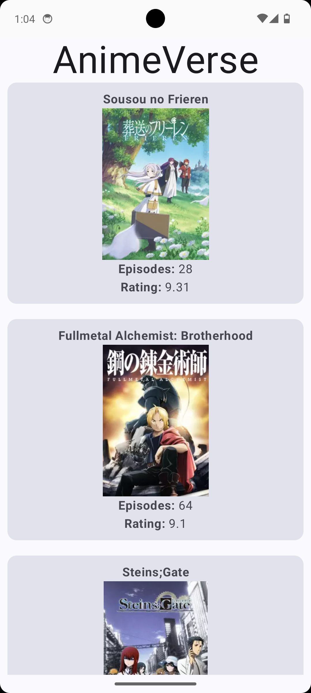
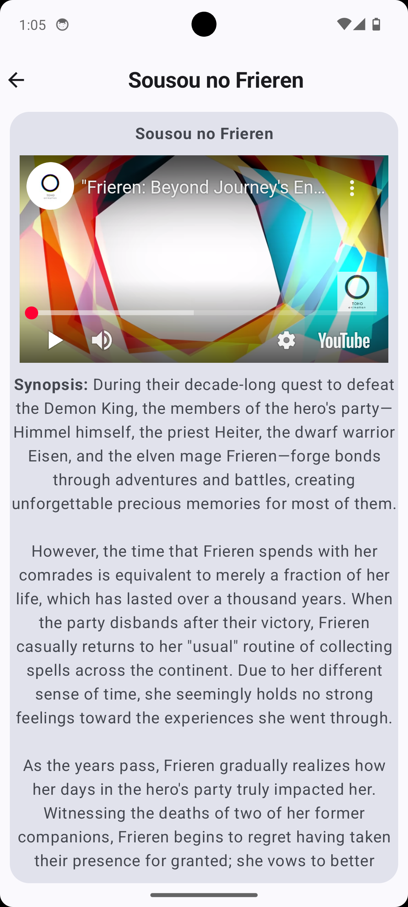

# AnimeVerse

## Overview:-

AnimeVerse is an application specifically designed for Android which lists popular or highest-rated anime series and uses the Jikan API It also gives you access to trailers, synopsis, genres, and others.

## Features:-

### AnimeListScreen (HomeScreen)

a.) Fetches and shows list of top-rated anime using Jikan API.

b.) Shows the following information for each anime:

    i) Title
    
    ii) Poster Image
    
    iii) Number of Episodes
    
    iv) Rating

c.) Users can click on an anime to see more details.

### AnimeDetailScreen

a.) Breaks down details of anime selected by user:

    i) Title
    
    ii) Video Player for playing the available youtube trailer. If a trailer is unavailable, the poster image is presented.
    
    iii) Synopsis
    
    iv) Number of Episodes
    
    v) Rating
    
    vi) Genre(s)
    
    viii) Main Cast

## API Endpoint Used:-

### Top Anime List:

<b>Endpoint:</b> https://api.jikan.moe/v4/top/anime

Used to retrieve the full list of top-rated anime for the Home Screen.

### Top Anime Details:

<b>Endpoint:</b>  https://api.jikan.moe/v4/anime/{anime_id}

Used to retrieve the details of selected anime for the Details Screen.

## Assumptions:-

1. Assumed that the Jikan API is responsive.

2. All anime listed have data available for usage (title, episodes, rating, etc...)

3. In case for an anime no trailer is available, the app will return the poster image.

4. Pagination keeps ignoring as the data from apis is less.

## Implementation Details:-

### Tech Stack:-

1. <b>Language:</b> Kotlin
2. <b>Architecture:</b> MVVM (Model-View-ViewModel)
3. <b>Networking:</b> Retrofit with Gson for API calls
4. <b>Image Loading:</b> Coil for loading poster images
5. <b>Video Playback:</b> YouTubePlayer to play trailers
6. <b>UI:</b> Jetpack Compose
7. <b>Asynchronous Programming:</b> Coroutines

### Key Components:-

#### 1. AnimeListScreen:-

a.) Use Retrofit to get the list of top-rated anime. 
b.) Shows the anime list in a LazyColumn 
c.) Click events to handle that redirect to Anime Detail Page. 

#### 2. AnimeDetailScreen:-

a.) Shows the trailer with YouTubePlayer or poster image in case of no trailer 
b.) Shows extra information: synopsis, genres, cast, etc. 

## How to Run the App:-
1. Clone the repository:
git clone [https://github.com/Rahula-12/AnimeVerse](https://github.com/Rahula-12/AnimeVerse)
2. Import project to Android Studio.
3. Run the app on an emulator or physical device.
4. If you want to download the apk and run it on your device, you can download it from:-
https://github.com/Rahula-12/AnimeVerse/releases/download/AnimeVerse/app-debug.apk

## Known Limitations:-

1. <b>API Rate Limiting:</b> The Jikan API applies an API rate limit, and making too many requests in a short amount of time can lead to delays or failures.
2. <b>Offline Support:</b> The app does not provide offline support.
3. <b>Main Cast Data:</b> The Jikan API doesn't really provide any data about cast members in the /anime/{anime_id} endpoint. For cast information /anime/{anime_id}/characters has been used.

## Future Enhancements
1. Use Room for caching data for offline functionality.
2. Since large datasets can be overwhelming, allow pagination in the anime list.
3. Implement a search function so users can search for specif anime.
4. handle network error messages and user friendly information

## Screenshots:-
Home Screen

Detail Screen

## Contact

Please contact me with any questions or comments:

<b>Email:</b> ra9853044@gmail.com 
<b>GitHub:</b> Rahula-12
